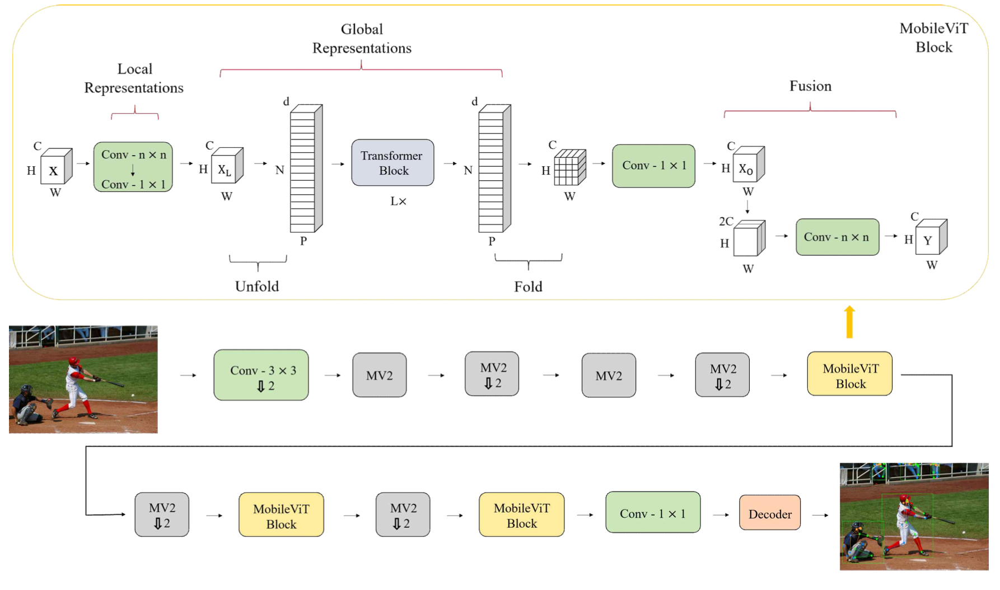

# MobileViTPose : Lightening of Human Pose Estimation Algorithm Using MobileViT and Transfer Learning

## Abstract
Transformer-based models, which have recently shown strength in the field of natural language processing, have also shown better performance than convolutional neural network-based models in the field of computer vision, increasing their influence. This is the same situation in the task of estimating human pose, and the appropriate example is that Vision Transformer-based ViTPose maintains the best performance in all human pose estimation benchmarks such as COCO, OCHuman, and MPII. However, because Vision Transformer has a heavy model structure with a large number of parameters and requires a relatively large amount of computation, it costs users a lot of money in learning. Therefore, this paper proposes a model that can perform human pose estimation tasks through a MobileViT-based model with fewer parameters and faster estimation. The proposed model is the Validation Set provided by the MS COCO human pose estimation benchmark, which showed 3.28GFLOPs and 9.72 million parameters of 1/5 and 1/9 compared to ViTPose, respectively, and showed relatively good performance by achieving 69.4 Mean Average Precision.

